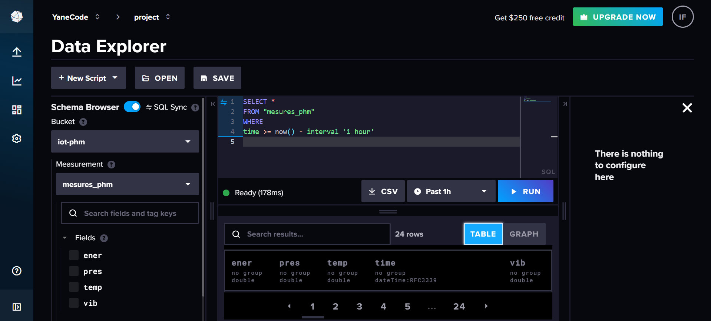
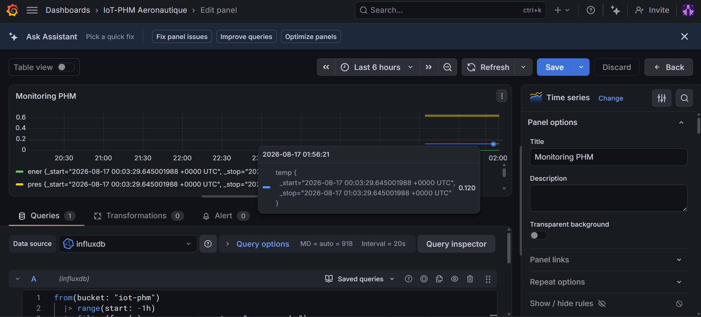

# IoT-PHM Aéronautique — Prototype de Monitoring Prédictif

Prototype de système IoT pour la surveillance en temps réel d'un équipement en contexte aéronautique, dans une logique de maintenance prédictive (PHM — *Prognostics and Health Management*).

## Contexte

Le projet vise à collecter en temps réel plusieurs grandeurs physiques critiques (température, pression, vibration, énergie), à les traiter pour détecter des anomalies précurseurs de défaillance, et à les transmettre vers une plateforme de visualisation — selon une architecture **Edge → Fog → Cloud**.

Faute de matériel physique disponible (Raspberry Pi) au démarrage du projet, le prototype a été développé et validé sous **Wokwi**, un simulateur de circuits électroniques.

## Architecture

```
[ESP32 + capteurs simulés (Wokwi)]
        |  Perception : collecte, filtrage, normalisation
        v
    MQTT (broker.emqx.io)
        v
[Node-RED]
        |  Fog : règles de détection d'anomalie, mesure de latence
        v
[InfluxDB Cloud]
        |  Stockage historique des séries temporelles
        v
[Grafana Cloud]
        |  Cloud : visualisation et dashboards
```

Cette séparation Edge/Fog est volontaire : la couche ESP32 (edge) ne fait **que** de la perception (collecte + filtrage + normalisation), toute la logique de décision (seuils, règles) est déportée dans Node-RED (fog) — ce qui permet de modifier les règles de détection sans reflasher le firmware.

## Capteurs et grandeurs surveillées

| Capteur | Grandeur | Ce qu'il indique |
|---|---|---|
| DHT22 | Température | Risque de surchauffe |
| BMP180 | Pression | Perte d'étanchéité / fuite |
| MPU6050 | Vibration (accéléromètre 3 axes) | Défaut mécanique, usure |
| Potentiomètre (proxy) | Énergie/consommation | Dérive électrique, court-circuit naissant |

## Traitement du signal (côté edge)

- **Filtrage** : moyenne mobile glissante (fenêtre de 5 échantillons) pour réduire le bruit de mesure
- **Normalisation** : min-max, ramène chaque grandeur dans l'intervalle [0, 1] pour les rendre comparables entre elles

## Détection d'anomalie (côté fog — Node-RED)

Chaque grandeur normalisée est comparée à un seuil (`>= 0.8` par défaut). Le dépassement d'un seuil déclenche une alerte. Cette logique vit entièrement dans Node-RED, pas dans le firmware ESP32.

Un nœud dédié mesure également la **latence de traitement** dans Node-RED (différence entre le timestamp de réception et le timestamp de fin de traitement), afin de vérifier que la couche fog ne constitue pas un goulot d'étranglement.

## Stack technique

| Couche | Outil | Rôle |
|---|---|---|
| Edge | Wokwi (ESP32 DevKit) | Simulation du matériel embarqué |
| Transport | MQTT (broker.emqx.io) | Transmission des mesures |
| Fog | Node-RED | Règles, détection d'anomalie, dashboard temps réel |
| Stockage | InfluxDB Cloud | Base de données de séries temporelles |
| Cloud | Grafana Cloud | Visualisation et dashboards historiques |

## Contenu du dépôt

- `firmware/` — code source ESP32 (Arduino), schéma de câblage Wokwi, librairies utilisées
- `node-red/flows.json` — export du flow Node-RED (règles, split des mesures, connexion InfluxDB)
- `screenshots/` — captures illustrant chaque étage de la chaîne (simulation, dashboard Node-RED, données InfluxDB, dashboard Grafana)

## Captures

**Simulation Wokwi (ESP32 + capteurs)**


**Flow Node-RED (règles + latence)**


**Dashboard temps réel Node-RED**


**Données stockées dans InfluxDB**


**Dashboard Grafana (visualisation historique)**


## Comment reproduire

1. Ouvrir le projet Wokwi avec `firmware/sketch.ino` et `firmware/diagram.json`, installer les librairies listées dans `firmware/libraries.txt`
2. Lancer la simulation — le firmware se connecte automatiquement au WiFi virtuel de Wokwi et publie sur MQTT
3. Importer `node-red/flows.json` dans une instance Node-RED (menu → Import), configurer le nœud MQTT in sur le même broker/topic, et le nœud InfluxDB out avec vos propres identifiants InfluxDB Cloud
4. Connecter Grafana à la même instance InfluxDB pour visualiser l'historique

## Prochaines étapes

Le projet se poursuit avec l'intégration d'un module de Machine Learning pour la maintenance prédictive (classification des pannes, score de risque, explicabilité via SHAP/LIME) — actuellement en cours de planification.

## Auteur

Ihsane — Cycle ingénieur Robotique et Objets Connectés, ENIAD Berkane
Stage technique, YaneCode Digital (Safi)
